Exercice 1 : Installation de Docker et vérification de l’environnement

Question 2 :

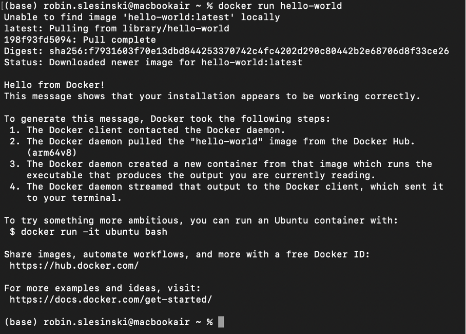

Question 3 :

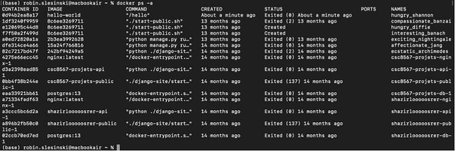

La commande suivante permet d’afficher l’ensemble des conteneurs Docker, qu’ils soient en cours d’exécution ou arrêtés :

Exercice 2 : Premiers pas avec Docker : images et conteneurs

Question 2.a :

Une image Docker est un modèle statique qui contient tout le nécessaire pour exécuter une application (code, dépendances, configuration). Elle ne change pas et ne s’exécute pas seule.

Un conteneur Docker est une instance active créée à partir d’une image. C’est l’image “en fonctionnement”, isolée du système hôte, et qui peut être démarrée, arrêtée ou supprimée indépendamment.

Question 2.b :

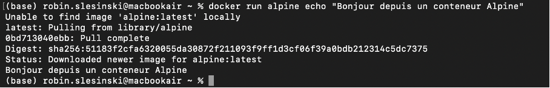

Docker télécharge l’image alpine si elle n’est pas déjà présente, crée un conteneur, exécute immédiatement la commande echo, puis affiche le message dans la console.

Question 2.c :

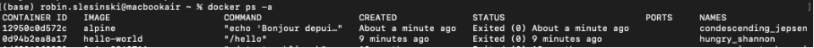

Le conteneur n’avait qu’une seule action à réaliser : afficher le message.
Une fois cette commande terminée, il n’y avait plus aucun processus à exécuter dans le conteneur. Docker l’a donc automatiquement arrêté et passé en statut Exited.

Question 2.d :

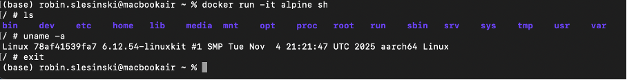

Après avoir lancé la commande, le conteneur démarre et on entre dans le shell sh du conteneur. La commande ls affiche l’aboresance, on voit ici les répertoires essentiels d’un système Linux minimal.

La commande uname -a montre que le conteneur tourne sur un noyau linux donné par docker, indépendant de notre système d’exploitation (mac OS ici), et indique également l’architecture (aarch64).

Exercice 3 : Construire une première image Docker avec une mini-API FastAPI

Question 3.a :

# app.py

# TODO: importer FastAPI

from fastapi import FastAPI

# TODO: créer une instance FastAPI

app = FastAPI()

# TODO: définir une route GET /health

@app.get("/health")

def health():

return {"status": "ok"}

Question 3.c:

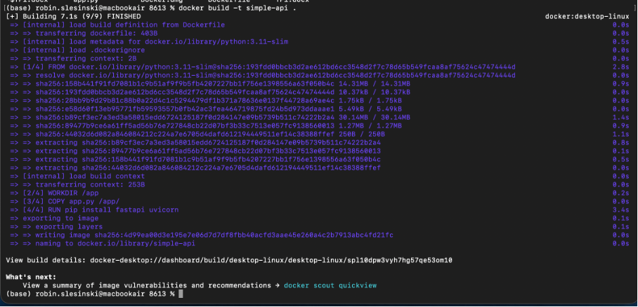

Exercice 4 : Exécuter l’API FastAPI dans un conteneur Docker

Question 4.a :

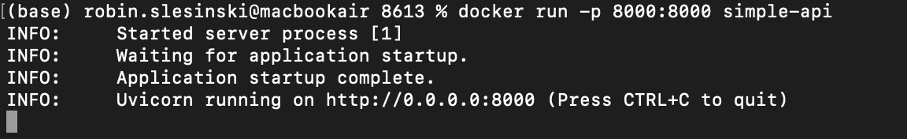

L’option -p 8000:8000 dans la commande docker run permet de rediriger le port 8000 du conteneur vers le port 8000 de l’ordinateur. Cela signifie que l’application FastAPI, qui écoute sur le port 8000 à l’intérieur du conteneur, devient accessible depuis le navigateur sur http://localhost:8000. Sans cette option, le conteneur tournerait normalement, mais il serait impossible d’y accéder depuis la machine hôte.

Question 4.b :

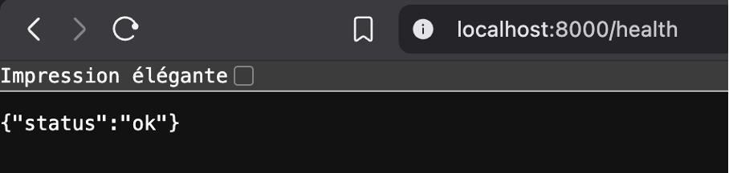

Question 4.c :

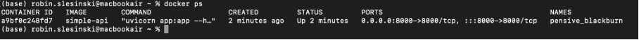

Nom du conteneur : pensive_blackburn

Image utilisée : simple-api

Port mappé : 0.0.0.0:8000->8000/tcp (le port 8000 du conteneur est accessible sur le port 8000 de la machine)

Question 4.d :
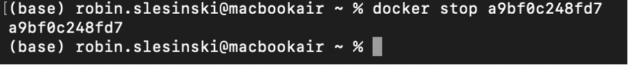

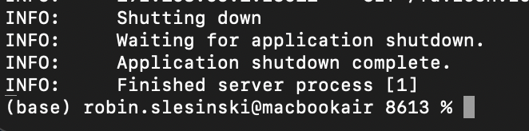

Dans ps :

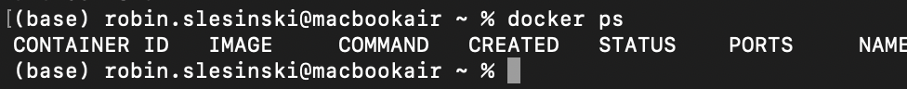

Dans ps -a :

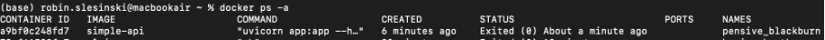

La commande docker ps n’affiche que les conteneurs en cours d’exécution, donc le conteneur arrêté n’y apparaît plus. Alors que docker ps -a liste tous les conteneurs, qu’ils soient actifs ou arrêtés, ce qui permet de voir l’historique des conteneurs et de récupérer leur nom ou ID.

Exercice 5 : Démarrer un mini-système multi-conteneurs avec Docker Compose

Docker-compose.yml :

version: "3.9"

services:

db:

image: postgres:16

environment:

# Définir l'utilisateur, le mot de passe et le nom de la base

POSTGRES_USER: demo

POSTGRES_PASSWORD: demo

POSTGRES_DB: demo

ports:

# Exposer le port PostgreSQL vers l'hôte

- "5432:5432"

api:

# Construire l'image à partir du Dockerfile dans ./api

build: ./api

ports:

# Exposer le port 8000 du conteneur vers l'hôte

- "8000:8000"

depends_on:

# Indiquer que l'API dépend de la base de données

- db

Question 5.c :

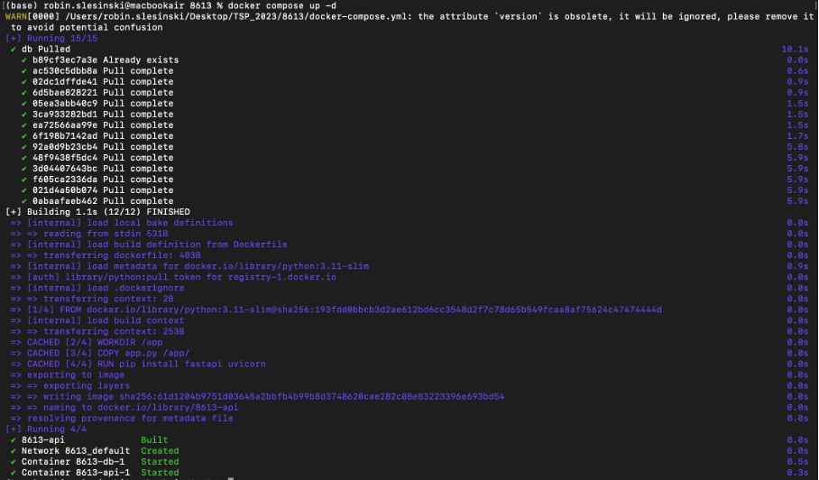

Puis docker compose ps :

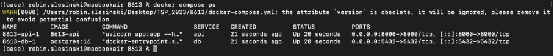

Question 5.d :

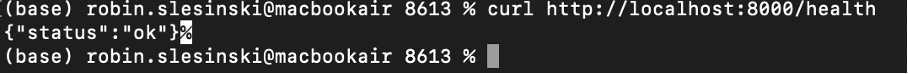

Question 5.e :

La commande docker stop <id> sert à arrêter un conteneur individuel en cours d’exécution. Le conteneur reste présent sur le système et peut être redémarré ultérieurement.

En revanche, docker compose down arrête tous les services définis dans le fichier docker-compose.yml et supprime leurs conteneurs associés, ainsi que les réseaux créés par Compose. Cela permet de nettoyer complètement l’environnement lié au projet, alors que docker stop n’agit que sur un seul conteneur.

Exercice 6 : Interagir avec la base de données PostgreSQL dans un conteneur

Question 6.a :

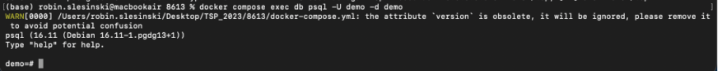

La commande docker compose exec db psql -U demo -d demo permet d’ouvrir un shell PostgreSQL à l’intérieur du conteneur.

exec : exécute une commande dans un conteneur déjà en cours d’exécution.

db : nom du service ou du conteneur dans lequel la commande sera exécutée (ici, le conteneur PostgreSQL).

-U demo : indique l’utilisateur PostgreSQL à utiliser pour se connecter (ici demo).

-d demo : spécifie la base de données à laquelle se connecter (ici demo).

Question 6.b :

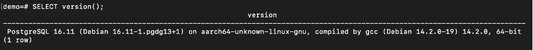

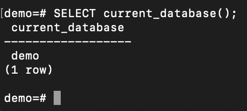

Question 6.c :

Pour qu’un autre service Docker, comme l’API, se connecte à la base de données PostgreSQL gérée par Docker Compose, il faut utiliser le nom du service comme hostname. Dans notre configuration :

Hostname : db (le nom du service PostgreSQL dans le fichier docker-compose.yml)

Port : 5432 (port interne du conteneur PostgreSQL)

Utilisateur : demo

Mot de passe : demo

Nom de la base : demo

Grâce à Docker Compose, tous les services définis dans le même fichier partagent un réseau interne, ce qui permet à l’API de se connecter à la base en utilisant db:5432 sans exposer le port sur l’hôte.

Question 6.d :

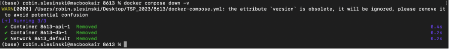

L’option -v de la commande docker compose down -v permet de supprimer également les volumes associés aux services. Cela signifie que toutes les données persistantes stockées dans ces volumes, comme les informations de la base PostgreSQL, seront entièrement effacées.

Exercice 7 : Déboguer des conteneurs Docker : commandes essentielles et bonnes pratiques

Question 7.a :

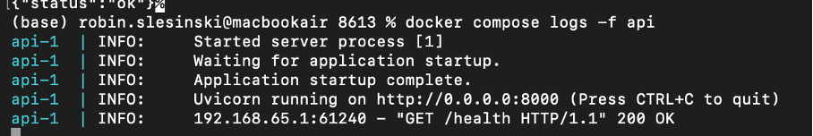

Lorsque l’API démarre correctement : les logs montrent que le serveur Uvicorn a démarré et est prêt à recevoir des requêtes, avec des messages tels que :

Started server process [1]

Waiting for application startup.

Application startup complete.

Uvicorn running on

Lorsque l’API reçoit une requête /health : un log apparaît indiquant que la requête a été traitée avec succès, par exemple :

192.168.65.1:61240 - "GET /health HTTP/1.1" 200 OK

Question 7.b:

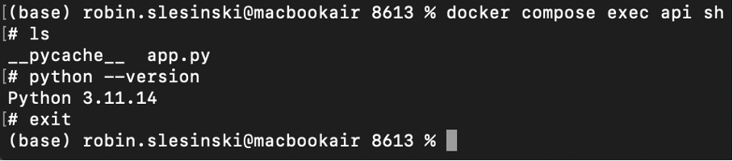

En tapant ls, on peut voir les fichiers présents dans le répertoire de travail, ici app.py et le dossier __pycache__ généré automatiquement par Python pour stocker les fichiers compilés. La commande python --version permet de vérifier que la version de Python installée dans le conteneur est bien Python 3.11.14, correspondant à celle définie dans le Dockerfile.

Question 7.c :

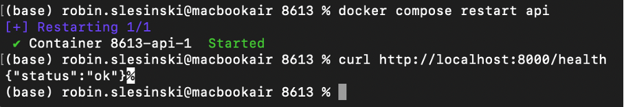

Un redémarrage est utile dans plusieurs situations, par exemple lorsqu’une mise à jour du code ou des dépendances a été effectuée, lorsqu’un conteneur rencontre un problème temporaire ou se bloque, ou encore pour appliquer certaines modifications de configuration sans avoir à arrêter tous les services du projet.

Question 7.d :

Je renomme app en appi dans app.py pour simuler une erreur.

Je comprends l’erreur en voyant que @app.get(« /health »), donc je comprends qu’il y a un problème à ce niveau là.

Question 7.e :

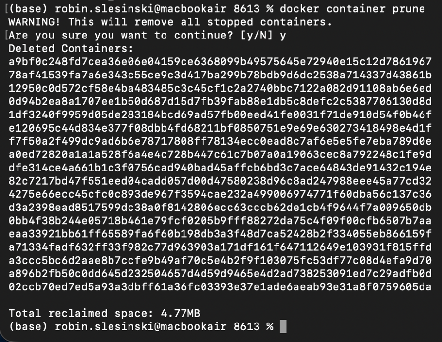

Cela permet de libérer de l’espace disque, d’éviter l’accumulation de fichiers et ressources obsolètes, et de maintenir l’environnement Docker organisé et performant. Sans ce nettoyage, Docker peut rapidement consommer beaucoup de stockage et rendre la gestion des conteneurs et images plus difficile.

Exercice 8 : Questions de réflexion et consignes pour le rendu

Question 8.a :

Un notebook Jupyter n’est pas idéal pour déployer un modèle en production car il est difficile d’assurer la reproductibilité et de gérer l’environnement avec toutes les dépendances nécessaires.

Question 8.b :

Docker Compose est utile quand on manipule plusieurs services, comme une API et une base de données, car il permet de démarrer et connecter facilement tous les services avec un seul fichier, garantissant un environnement cohérent et reproductible.