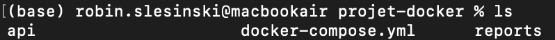
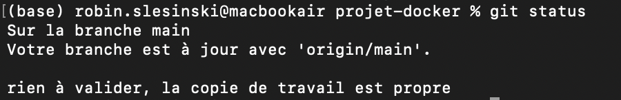
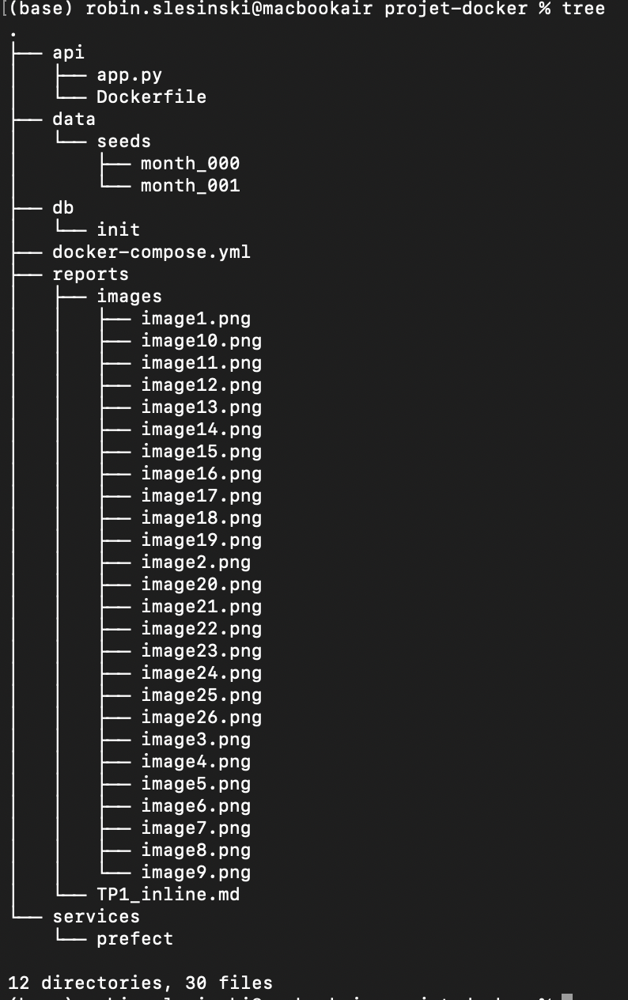
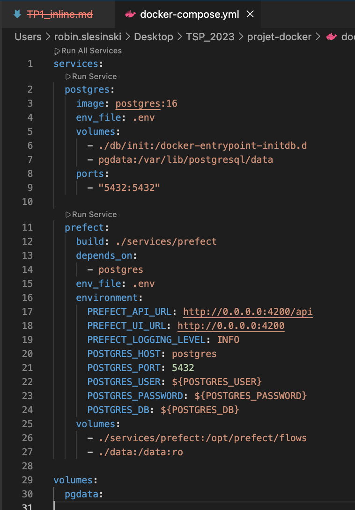
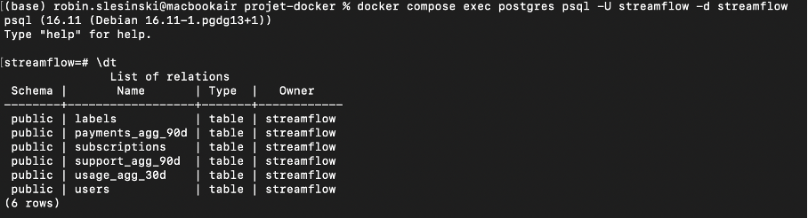
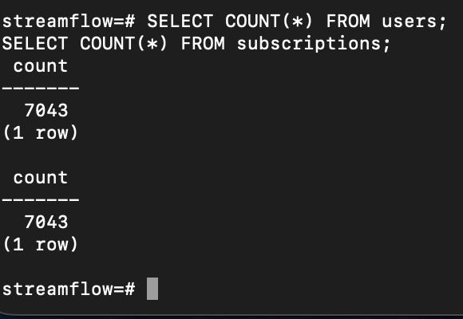
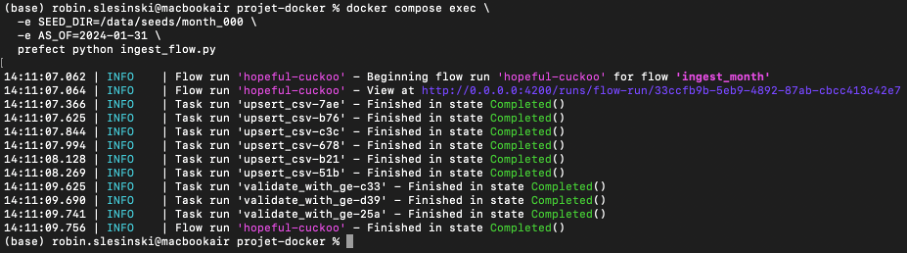
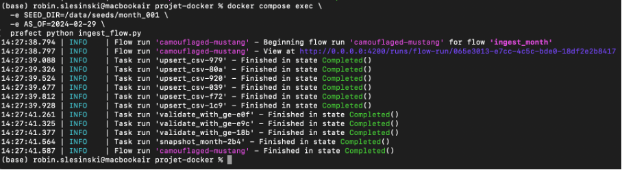
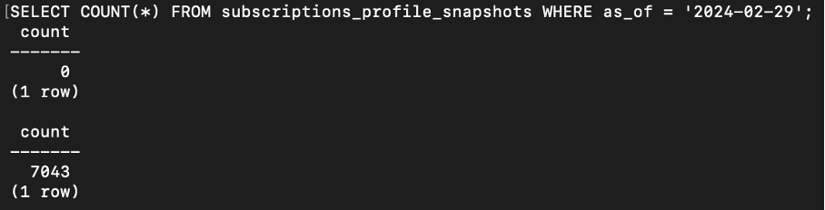
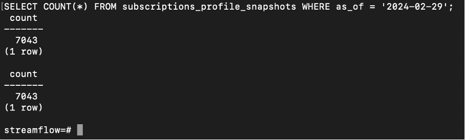

TP2
Exercice 1 : Mise en place du projet et du rapport

Question 1.a : 

 

Question 1.b :

 

Question 1.c :

 

Exercice 2 : Base de données et docker-compose

Question 2.a :

Le fichier a bien été recopié

Question 2.b :

Un fichier .env sert à stocker les variables d’environnement d’un projet Docker (mots de passe, ports, configurations… ), afin de ne pas les écrire directement dans les fichiers de configuration et de pouvoir les modifier facilement sans toucher au code.

Question 2.c :

 

Question 2.d :

 

labels — Cette table contient les catégories ou étiquettes associées aux utilisateurs, aux transactions ou aux événements dans le système.

payments_agg_90d — Cette table stocke une agrégation des paiements sur les 90 derniers jours, probablement pour faciliter des analyses ou des rapports périodiques.

subscriptions — Cette table enregistre les abonnements des utilisateurs, avec les informations liées à leur statut ou leur renouvellement.

support_agg_90d — Cette table regroupe des statistiques sur les tickets ou demandes de support sur les 90 derniers jours.

usage_agg_30d — Cette table contient des données agrégées sur l’utilisation du service par les utilisateurs sur une période de 30 jours.

users — Cette table stocke les informations principales des utilisateurs, comme leur identité ou leur statut dans le service.

Exercice 3 - Upsert des CSV avec Prefect (month_000)
Question 3.a :

Le conteneur prefect sert à orchestrer notre pipeline d’ingestion : il organise et exécute les différentes étapes du traitement des données, ce qui nous permet d’automatiser le processus et de suivre facilement son bon déroulement.

Question 3.b :

La fonction upsert_csv lit un CSV, corrige quelques types (comme les dates ou les booléens), puis envoie les données dans PostgreSQL. Elle importe d’abord le fichier dans une table temporaire, puis fait un INSERT … ON CONFLICT : si la ligne existe déjà, elle est mise à jour, sinon elle est ajoutée. Cela permet de garder les tables à jour sans créer de doublons.

Question 3.c :a

 

On a maintenant 7043 utilisateurs.

Exercice 4 : Validation des données avec Great Expectations

Question 4.a :

La fonction validate_with_ge agit comme un garde qui va assurer la qualité dans le pipeline d’ingestion. Elle récupère les données insérées en PostgreSQL, applique des expectations Great Expectations (vérification des colonnes attendues et bornes raisonnables pour les agrégats), et fait échouer le flow si les validations ne sont pas respectées.

Question 4.b :

 

Question 4.c :

Pour la table usage_agg_30d, nous avons vérifié que certaines colonnes numériques étaient toutes supérieures ou égales à zéro, par exemple watch_hours_30d, avg_session_mins_7d ou unique_devices_30d. Ces bornes ont été choisies car ces métriques représentent des quantités physiques (heures de visionnage, minutes de session, nombre d’appareils, etc.) qui ne peuvent pas être négatives.

Cette vérification protège le modèle en évitant que des valeurs impossibles ou des fichiers corrompus ne viennent fausser les calculs et les prédictions. Elle garantit ainsi que les données utilisées pour l’entraînement sont cohérentes et fiables, ce qui est essentiel pour obtenir des résultats robustes.

Exercice 5 : Snapshots et ingestion month_001

Question 5.a :

Question 5.b :

 

 

Après exécution du flow pour le 29 février 2024, la table subscriptions_profile_snapshots contient 7043 lignes correspondant à l’état des utilisateurs à cette date. Le snapshot du 31 janvier 2024 est vide car le flow n’a pas été exécuté pour ce mois. Chaque snapshot reflète donc uniquement les données du mois pour lequel le flow a été lancé, et le nombre de lignes peut varier selon les utilisateurs présents.

On peut relancer les deux execs afin de voir les deux à 7043.

Synthèse :

CSV mensuels (month_000, month_001, ...)
        │
        ▼
   upsert_csv()  ──> Tables live (users, subscriptions, usage_agg_30d, ...)
        │
        ▼
 validate_with_ge()  ──> Contrôle qualité des données
        │
        ▼
 snapshot_month(as_of) ──> Tables *_snapshots (historique mensuel)

Explication

On ne travaille pas directement sur les tables live pour entraîner un modèle afin de préserver l’intégrité des données et éviter que des erreurs ou des valeurs corrompues affectent négativement l’entraînement. Les snapshots mensuels figent l’état des données à une date donnée (as_of), ce qui permet de reproduire exactement le jeu de données d’un mois  donné.

Réflexion personnelle

La partie la plus difficile a été de gérer correctement l’upsert et la validation des données avec Great Expectations, en particulier d’identifier les colonnes exactes et de choisir des bornes raisonnables.

