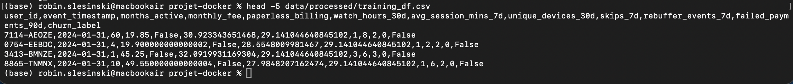
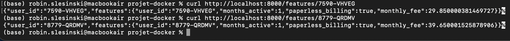

# Contexte

Nous disposons déjà de plusieurs sources de données : des snapshots mensuels (pour deux périodes) qui figent l’état des utilisateurs dans le temps, ainsi que des tables “live” regroupant les informations d’abonnement, d’usage (30 jours), de paiements (90 jours) et de support (90 jours). L’objectif du TP3 est de connecter ces données au Feature Store Feast, afin de pouvoir récupérer des features aussi bien en mode offline (entraînement) qu’en mode online (prédiction en temps réel). À partir de cela, nous allons également exposer un petit endpoint API qui interroge Feast pour servir des features en ligne. Ce TP s’inscrit dans la continuité du projet StreamFlow, dont la finalité est de construire un pipeline complet allant de l’ingestion jusqu’à la mise à disposition de features utilisables par un modèle de machine learning.

# Mise en place de Feast

Pour démarrer l’ensemble des services (PostgreSQL, Prefect et Feast), j’ai utilisé la commande suivante :

docker compose up -d --build

Le conteneur feast contient toute la configuration du Feature Store, située dans le répertoire /repo (monté depuis ./services/feast_repo/repo). C’est là que se trouvent les fichiers feature_store.yaml, les définitions de sources, et les Feature Views. J’utilise ensuite ce conteneur pour exécuter les commandes Feast

# Définition du Feature Store

Question 3.a:

Dans Feast, une Entity sert simplement à dire « pour qui » on calcule les features. Dans notre projet, l’entité principale est l’utilisateur, identifié par son user_id. C’est pratique car toutes nos tables utilisent déjà cette colonne pour représenter un client. Cela permet donc à Feast de regrouper facilement toutes les informations d’un même utilisateur lorsqu’on demandera des features, que ce soit pour l’entraînement ou pour la prédiction.

Question 3.b:

Parmi les tables de snapshots que nous utilisons dans Feast, on peut citer usage_agg_30d_snapshots. Elle regroupe plusieurs features liées au comportement d’usage des utilisateurs, comme par exemple : watch_hours_30d (heures regardées sur 30 jours), avg_session_mins_7d (durée moyenne des sessions), unique_devices_30d (nombre d’appareils utilisés) ou encore skips_7d (nombre de sauts de contenu sur 7 jours). Ces colonnes serviront directement de features pour le modèle.

Question 3.c:

La commande feast apply permet à Feast de lire toute la configuration du Feature Store (Entities, DataSources, FeatureViews) et de la synchroniser avec son registre interne. Elle crée ou met à jour les objets nécessaires dans le fichier registry.db. C’est l’étape qui “déploie” la définition du Feature Store pour que Feast puisse ensuite servir les features en ligne ou hors-ligne.

# Récupération offline & online

docker compose exec prefect python build_training_dataset.py

(base) robin.slesinski@macbookair projet-docker % ls data/processed/
training_df.csv

Question 4.d:

Feast s’assure de ne récupérer pour chaque utilisateur que les valeurs de features disponibles à la date du snapshot. Le champ as_of dans les DataSources sert de référence temporelle, et entity_df indique pour chaque user la date de l’événement. Cela garantit que le modèle ne voit jamais des informations du futur.

Question 4.g:

{'user_id': ['8779-QRDMV'], 'paperless_billing': [True], 'months_active': [1], 'monthly_fee': [39.650001525878906]}

Si on interrogez un user_id pour lequel aucune feature n’a été matérialisée (utilisateur inexistant ou en dehors de la fenêtre de snapshot), Feast renverra des valeurs None pour ces features, car il n’existe pas de donnée correspondante dans le Feature Store.

Question 4.j:

# Réflexion

Le endpoint /features/{user_id} nous permet de récupérer les mêmes features pour un utilisateur, que ce soit pour entraîner le modèle ou pour faire une prédiction en production. Comme ça, le modèle voit les mêmes données dans les deux cas, ce qui évite des erreurs liées à des différences entre entraînement et production (le fameux training-serving skew). Feast centralise tout le calcul des features, donc on est sûr que tout reste cohérent.