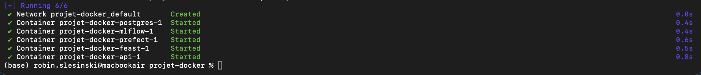
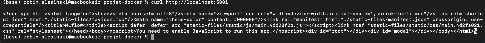
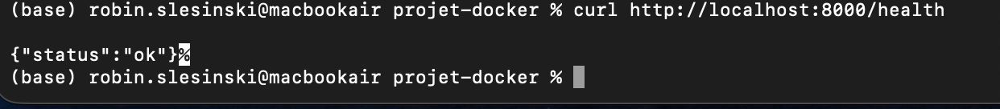
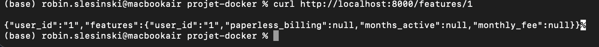
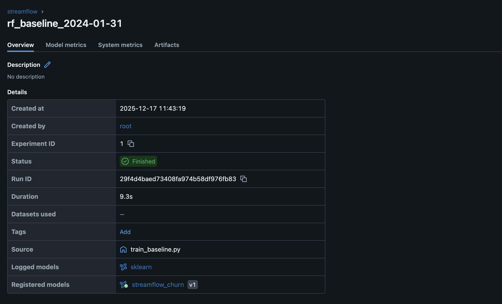
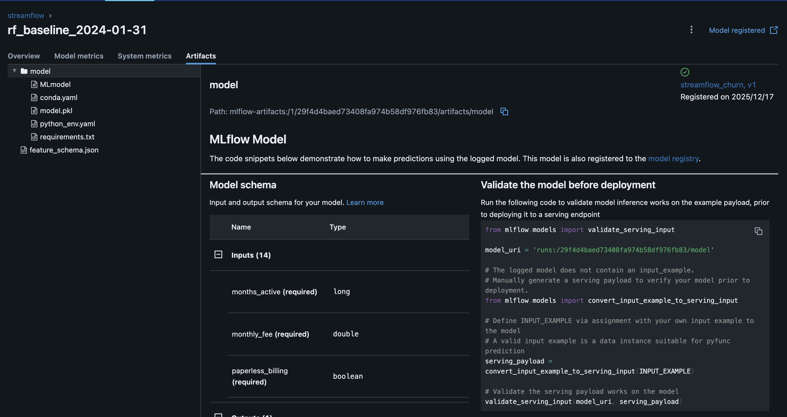
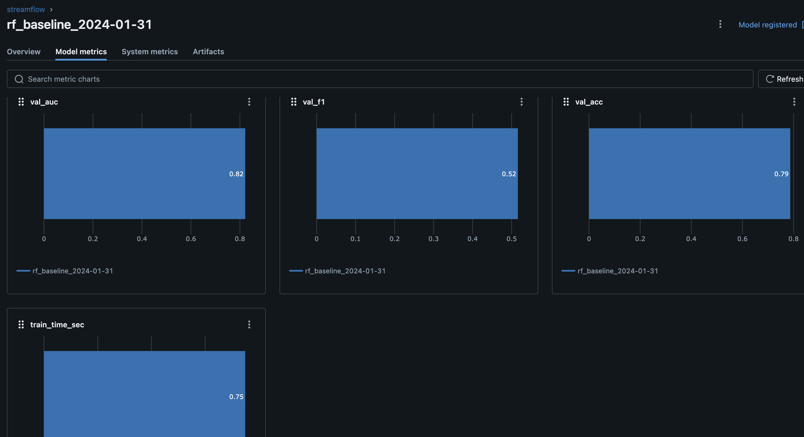
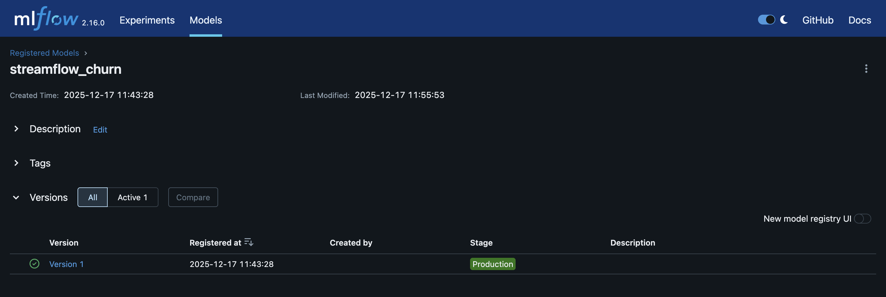
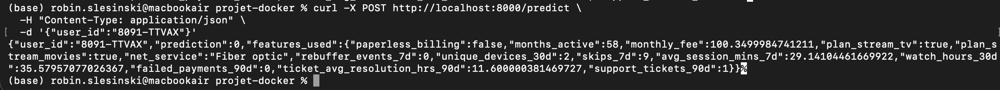
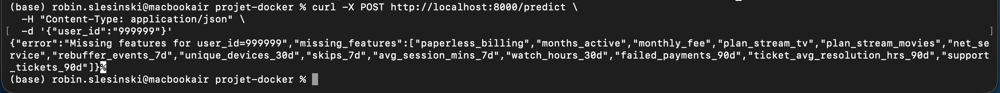

# Exercice 1 : Mise en route + rappel de contexte (sanity checks + où on en est dans la pipeline)

Question 1.b:

J'ai du modifier le port 5000 en 5001 car sur macOS, ControlCe correspond au Control Center / service système Apple (lié à certaines fonctions réseau / continuité) utilise déjà ce port.

Quesiton 1.c:

Question 1.d :

Question 1.e:

Images ci-dessus

La stack Docker Compose est correctement démarrée. Le conteneur PostgreSQL fournit le stockage des métadonnées et des données persistantes. Feast gère le feature store et les features online. L’API expose les endpoints applicatifs et permet l’accès aux features. MLflow est utilisé pour le suivi des expériences et des modèles. Prefect orchestre les workflows de données et de machine learning. L’ensemble des services est en état « Up », confirmant le bon fonctionnement global de la stack.

# Exercice 2 : Créer un script d’entraînement + tracking ML�ow (baseline RandomForest)

Question 2.b:

[OK] Trained baseline RF. rows_after_merge=7043 AUC=0.8217 F1=0.5161 ACC=0.7871 train_time=0.75s (run_id=29f4d4baed73408fa974b58df976fb83)

Question 2.c. Résultats du training baseline

- **AS_OF utilisé :** 2024-01-31  
- **Nombre de lignes du dataset d’entraînement (après merge) :** 7043  
- **Colonnes catégorielles détectées (cat_cols) :** ['paperless_billing', 'plan_stream_tv', 'plan_stream_movies', 'net_service']  
- **Métriques calculées sur validation :**  
  - AUC : 0.8217  
  - F1 : 0.5161  
  - ACC : 0.7871  
- **Temps d’entraînement :** 0.75 s

Question 2.d:

Dans un pipeline MLOps, fixer AS_OF permet de s'assurer que l'ensemble des données utilisées pour l'entraînement est constant et reproduit exactement le même snapshot des features et labels. Cela évite les variations dues à des mises à jour de la base ou à des données temporelles changeantes.  

Fixer random_state garantit que les opérations aléatoires dans le pipeline, comme le split train/validation ou l'initialisation des modèles (ex. RandomForest), produisent toujours le même résultat. Cela permet de comparer les métriques entre différentes expériences de manière fiable et de déboguer plus facilement.  

En combinant AS_OF et random_state, on obtient un pipeline répétable et déterministe, essentiel pour la validation, le suivi MLflow et la mise en production sécurisée.

# Exercice 3 : Explorer l’interface ML�ow et promouvoir un modèle

Question 3.a :

Question 3.f:

Version 1

Question 3.g:

Promouvoir un modèle via les stages (None, Staging, Production) permet de **contrôler facilement les versions**, de **tester avant mise en production** et d’éviter les erreurs liées aux fichiers locaux. Cela rend le déploiement plus **fiable et sûr** que de copier manuellement les artefacts.

# Exercice 4: Étendre l’API pour exposer /predict (serving minimal end-to-end)

Question 4.f : 

# Exercice 5 : Robustesse du serving : cas d’échec réalistes (sans monitoring)

Question 5.c:

Requête réussie : 

 #meme que au dessus

Requête echec :

En phase de serving, plusieurs problèmes peuvent survenir. Si l’entité demandée n’existe pas dans l’online store (user_id absent), l’API ne peut pas récupérer les features et la prédiction échoue. De même, si l’online store est incomplet ou obsolète, certaines features peuvent être manquantes ou nulles, ce qui peut entraîner des erreurs ou des prédictions incohérentes. Ces problèmes peuvent être détectés tôt en vérifiant la présence des features côté API, en ajoutant des contrôles sur les valeurs manquantes et en surveillant les logs et métriques d’erreur.

# Exercice 6 : Ré�exion de synthèse (ingénierie MLOps)

Question 6.a : 

MLflow assure la traçabilité en enregistrant paramètres, métriques et artefacts de chaque entraînement. Il permet aussi d’identifier précisément quel modèle est servi grâce au Model Registry et aux versions.

Question 6.b :

Le stage Production désigne le modèle chargé automatiquement par l’API au démarrage. Cela permet de changer de modèle sans redéployer l’API et évite d’utiliser un modèle non validé.

Question 6.c :

La reproductibilité peut casser si les données évoluent, si le code ou les dépendances changent, ou si la configuration de l’environnement est différente.

