# Exercice 1 : Démarrer la stack pour l'observabilité

Question 1.e:

Les conteneurs lancés sont : projet-docker-api-1 (API), projet-docker-feast-1 (Feast),
projet-docker-mlflow-1 (MLflow), projet-docker-postgres-1 (PostgreSQL),
streamflow-prometheus (Prometheus) et streamflow-grafana (Grafana).

Prometheus utilise `api:8000` et non `localhost:8000` car, à l’intérieur du réseau Docker Compose,
les services communiquent entre eux via le nom du service (DNS interne Docker) et non via
localhost, qui ferait référence au conteneur Prometheus lui-même.

Question 1.f :

(base) robin.slesinski@macbookair projet-docker % docker compose ps
NAME                       IMAGE                           COMMAND                  SERVICE      CREATED         STATUS         PORTS
projet-docker-api-1        projet-docker-api               "uvicorn app:app --h…"   api          2 minutes ago   Up 2 minutes   0.0.0.0:8000->8000/tcp, [::]:8000->8000/tcp
projet-docker-feast-1      projet-docker-feast             "bash -lc 'tail -f /…"   feast        2 minutes ago   Up 2 minutes   
projet-docker-mlflow-1     ghcr.io/mlflow/mlflow:v2.16.0   "mlflow server --bac…"   mlflow       2 minutes ago   Up 2 minutes   0.0.0.0:5001->5000/tcp, [::]:5001->5000/tcp
projet-docker-postgres-1   postgres:16                     "docker-entrypoint.s…"   postgres     2 minutes ago   Up 2 minutes   0.0.0.0:5432->5432/tcp, [::]:5432->5432/tcp
streamflow-grafana         grafana/grafana:11.2.0          "/run.sh"                grafana      2 minutes ago   Up 2 minutes   0.0.0.0:3000->3000/tcp, [::]:3000->3000/tcp
streamflow-prometheus      prom/prometheus:v2.55.1         "/bin/prometheus --c…"   prometheus   2 minutes ago   Up 2 minutes   0.0.0.0:9090->9090/tcp, [::]:9090->9090/tcp
(base) robin.slesinski@macbookair projet-docker % 

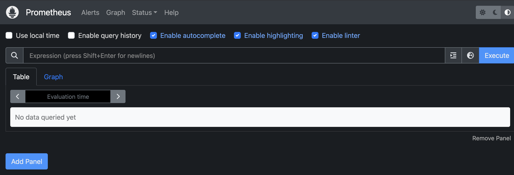

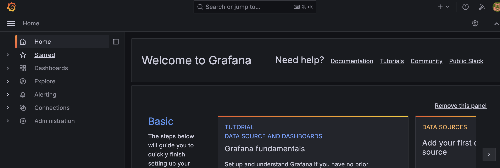

# Exercice 2 : Instrumentation de FastAPI avec de métriques Prometheus

Question 2.c:

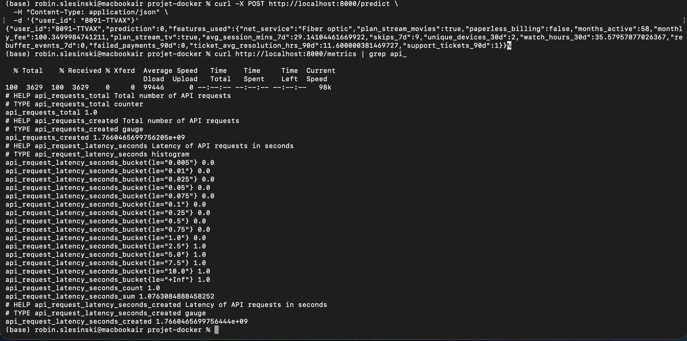

Un histogramme est plus utile qu’une moyenne car il montre la distribution des latences, pas juste une valeur globale.
Avec une moyenne, quelques requêtes très lentes peuvent être cachées.
L’histogramme permet de voir combien de requêtes sont rapides ou lentes et de détecter des pics anormaux.
C’est essentiel pour comprendre le comportement réel de l’API en production.

# Exercice 3 : Exploration de Prometheus (Targets, Scrapes, PromQL)

Question 3.a:

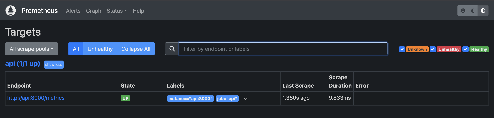

Question 3.b:

Pour up : 

up{instance="api:8000", job="api"}

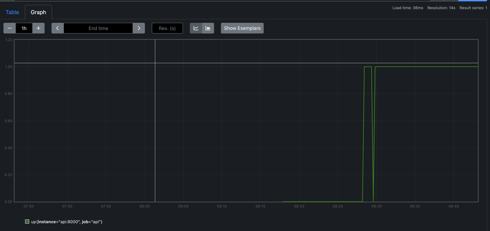

Résultat : 1 pour chaque service qui tourne, 0 si un service est down.

Interprétation : ça montre si les services monitorés (API, Prometheus, etc.) sont actifs et accessibles.

Pour api_requests_total :

api_requests_total{instance="api:8000", job="api"}

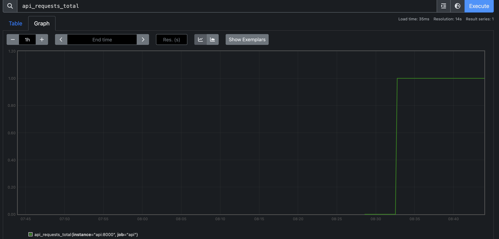

Résultat : un compteur cumulatif du nombre total de requêtes reçues par l’API depuis son démarrage.

Interprétation : on voit combien de requêtes l’API a traitées en tout, mais pas leur rythme dans le temps.

Pour rate(api_requests_total[5m]):

{instance="api:8000", job="api"}

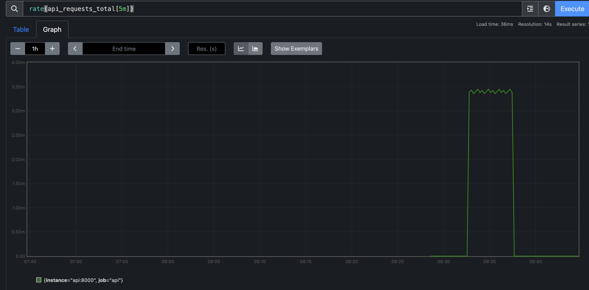

Résultat : le taux moyen de requêtes par seconde sur les 5 dernières minutes.

Interprétation : ça montre la charge actuelle de l’API, utile pour détecter des pics ou une baisse d’activité.

Question 3.c:

Avant predict : 

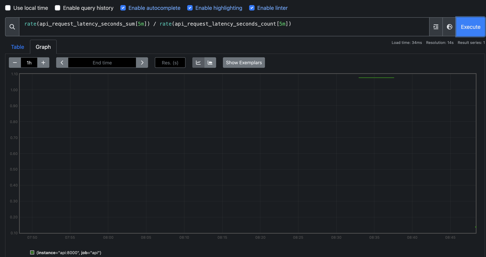

Après predict : 

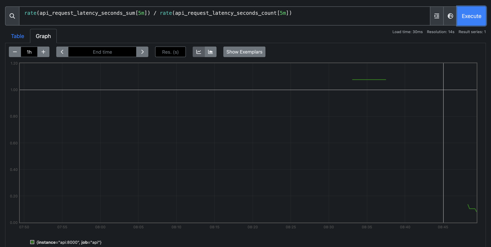

Elle calcule la latence moyenne des requêtes sur les 5 dernières minutes en utilisant l’histogramme.

La latence ne bouge pas, voir même elle desencd, sûrement car les requêtes ne sont pas assez volumineuses et nombreuses.

Question 3.d :

Voir les images ci-dessus.

# Exercice 4 : Setup de Grafana Setup et création d'un dashboard minimal

Question 4.e:

Pic de traffic : 

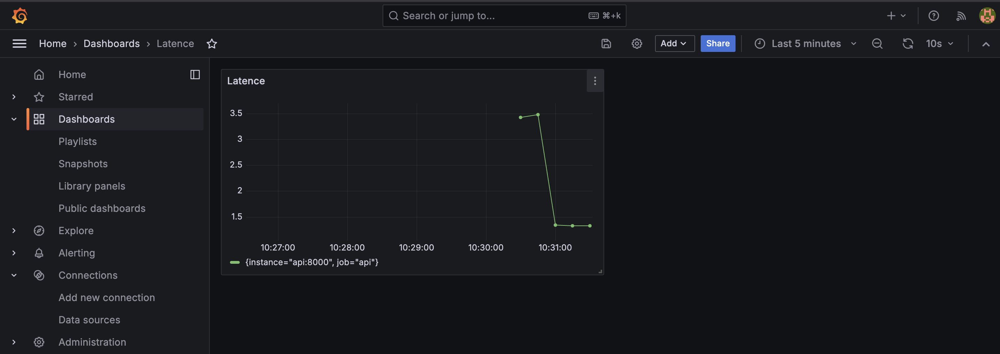

Nombre de requêtes :

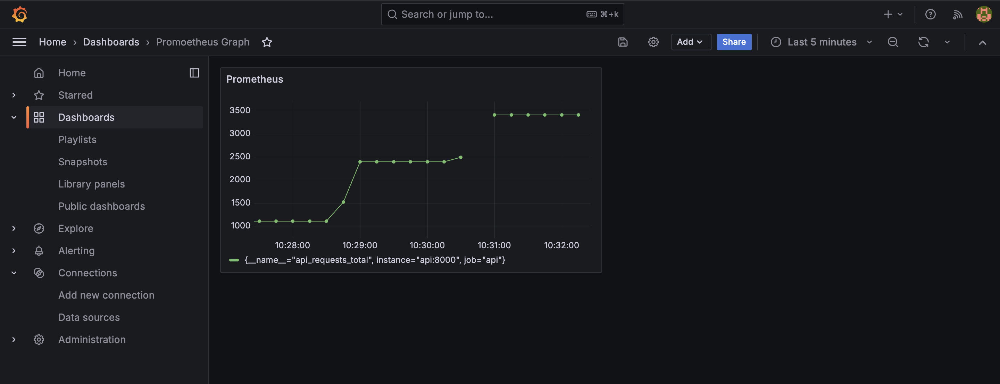

Edition du panel latence : 

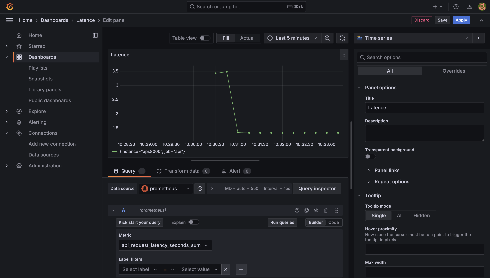

Ces métriques permettent de suivre la santé et la performance de l’API : le nombre de requêtes par seconde (RPS) montre la charge de trafic, et l’histogramme de latence indique combien de temps l’API met à répondre. On peut détecter rapidement des pics de trafic ou des ralentissements. Par contre, elles ne disent rien sur la qualité des prédictions du modèle ni sur la précision ou la justesse des réponses retournées. Elles ne permettent pas non plus de détecter des erreurs logiques ou des biais dans les données. Ces métriques sont donc utiles pour la supervision technique, mais pas pour évaluer la performance métier du modèle.

# Exercice 5 : Drift Detection with Evidently (Month_000 vs Month_001)

Question 5.c :

Décision finale : 

[Evidently] report_html=/reports/evidently/drift_month_000_vs_month_001.html report_json=/reports/evidently/drift_month_000_vs_month_001.json drift_share=0.04 -> NO_ACTION drift_share=0.04 < 0.30 (target_drift=0.02385347153201764)

captures écrans :

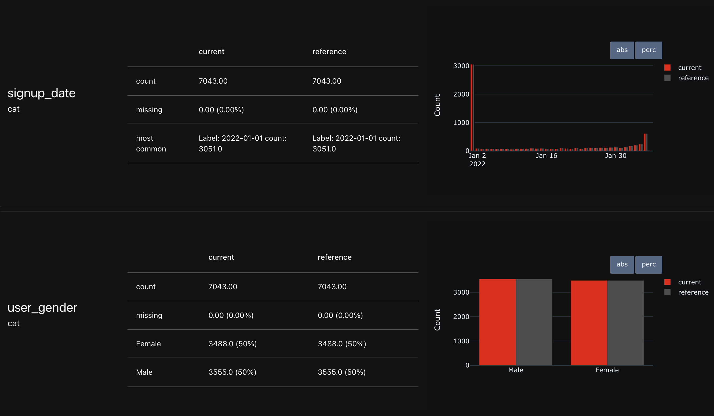

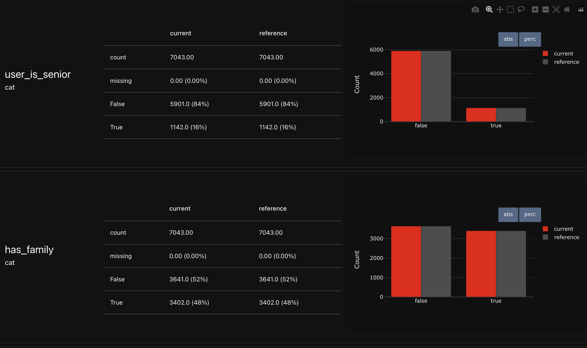

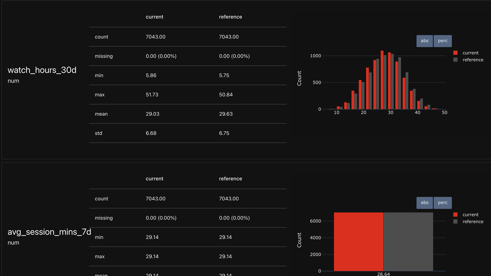

Dans ce projet, on distingue deux types de drift : le covariate drift, qui correspond à un changement dans la distribution des variables explicatives (features) entre les périodes comparées, et le target drift, qui correspond à un changement dans la distribution de la variable cible (churn_label). Le covariate drift peut impacter la performance du modèle même si la proportion de churn reste stable, tandis que le target drift reflète directement une variation du comportement observé.