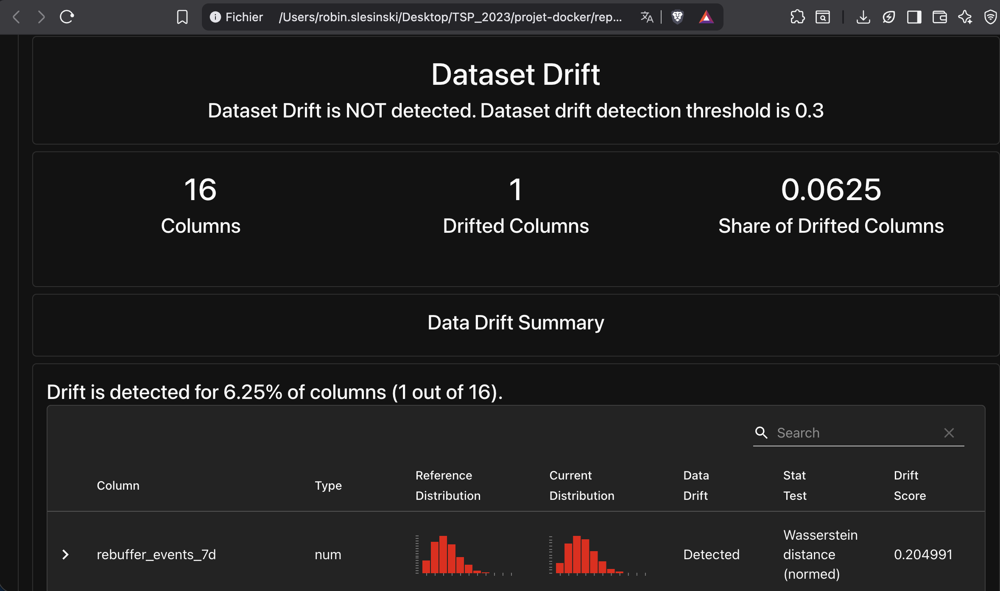
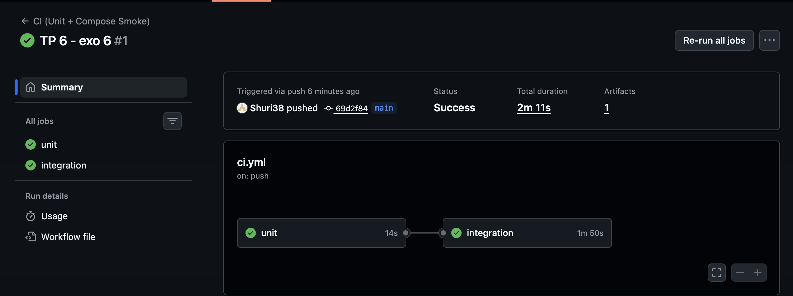

# Exercice 1 : Mise en place du rapport et vérifications de départ

Question 1.c: 

# Exercice 2 : Ajouter une logique de décision testable (unit test)

Question 2.d :

On extrait une fonction pure pour pouvoir tester la logique métier indépendamment de Prefect, MLflow ou de l’environnement d’exécution. Cela permet d’avoir des tests simples, rapides et déterministes, qui valident uniquement la règle de décision sans dépendances externes ni effets de bord.

# Exercice 3 : Créer le flow Prefect train_and_compare_flow (train → eval → compare → promote)

Question 3.d :

[COMPARE] candidate_auc < prod_auc + delta (delta=0.01)
[SUMMARY] as_of=2024-02-29 cand_v=3 prod_v=1 -> skipped

Le paramètre delta permet d’éviter la promotion d’un nouveau modèle pour des gains de performance marginaux pouvant être dus au bruit statistique ou à la variabilité du jeu de validation. Il garantit que seules des améliorations significatives justifient un changement en Production.

# Exercice 4 : Connecter drift → retraining automatique (monitor_flow.py)

Question 4.c:

Même si le drift global n’atteint pas le seuil (0.3), nous avons forcé l’exécution du flow avec threshold=0.0 pour démonstration. La colonne driftée représente 6,25 % des colonnes du dataset (1 sur 16).

# Exercice 5 : Redémarrage API pour charger le nouveau modèle Production + test /predict

Question 5.c : 

(base) robin.slesinski@macbookair projet-docker %  
curl -s -X POST "http://localhost:8000/predict" \
  -H "Content-Type: application/json" \
  -d '{"user_id":"9763-GRSKD"}' | jq  
user_id,signup_date,user_gender,user_is_senior,has_family,has_dependents
7590-VHVEG,2022-02-05,Female,False,True,False
{
  "user_id": "9763-GRSKD",
  "prediction": 0,
  "features_used": {
    "months_active": 13,
    "plan_stream_movies": false,
    "plan_stream_tv": false,
    "net_service": "DSL",
    "monthly_fee": 49.95000076293945,
    "paperless_billing": true,
    "rebuffer_events_7d": 3,
    "unique_devices_30d": 2,
    "watch_hours_30d": 29.941709518432617,
    "avg_session_mins_7d": 29.14104461669922,
    "skips_7d": 6,
    "failed_payments_90d": 0,
    "support_tickets_90d": 0,
    "ticket_avg_resolution_hrs_90d": 8.300000190734863
  }
}
(base) robin.slesinski@macbookair projet-docker % 

L’API doit être redémarrée après la promotion d’un nouveau modèle car le modèle est chargé en mémoire uniquement au démarrage. Sans redémarrage, l’API continuerait à utiliser l’ancienne version pour les prédictions.

# Exercice 6 : CI GitHub Actions (smoke + unit) avec Docker Compose

Question 6.c : 

Docker Compose est démarré dans la CI afin de lancer l’ensemble des services dépendants (API, PostgreSQL, Feast, MLflow) pour effectuer des tests d’intégration multi-services, vérifiant ainsi que tous les composants communiquent correctement.

# Exercice 7 : Synthèse finale : boucle complète drift → retrain → promotion → serving

Question 7.a : 

Le drift est mesuré avec Evidently en comparant les distributions des colonnes du dataset de production avec celles de référence. Le drift_share indique la proportion de colonnes ayant changé. Le seuil de 0,02 sert à déclencher un retrain de démonstration si le drift est trop faible.

Le flow train_and_compare_flow entraîne un modèle candidat et compare sa val_auc avec celle du modèle en production. Si le candidat est meilleur, il est promu, sinon il est ignoré.

Prefect s’occupe de lancer et gérer toutes ces étapes automatiquement, tandis que GitHub Actions sert à vérifier que le code et les services fonctionnent correctement avec des tests unitaires et des tests d’intégration.

Question 7.b :

La CI ne doit pas entraîner le modèle complet car c’est long et non stable. Il manque des tests comme des tests de bout en bout ou de robustesse aux données. Dans la vraie vie, il faut souvent un contrôle humain pour valider le modèle avant de le mettre en production.

